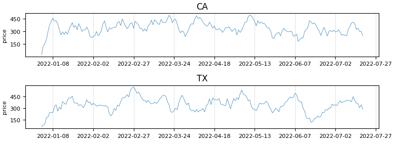

[](https://pypi.org/project/temporian/)
[](https://temporian.readthedocs.io/en/stable/?badge=stable)


**Temporian** is a Python library for **feature engineering** 🛠 and **data augmentation** ⚡ of **temporal data** 📈 (e.g. time-series, transactions) in **machine learning applications** 🤖.

> **Warning**
> Temporian development is in alpha.

## Key features

- Temporian operates natively on **multivariate** and **multi-index time-series** and **time-sequences** data. With Temporian, all temporal data processing is unified.

- Temporian favours **iterative** and **interactive** development in Colab, where users can **easily visualise intermediate results** 📊 each step of the way.

- Temporian introduces a novel mechanism to **prevent unwanted future leakage** and **training/serving skew** 😰. Temporian programs always return the same result in batch and in streaming mode.

- Temporian programs can run seamlessly **in-process** in Python, on **large datasets using [Apache Beam](https://beam.apache.org/)** ☁️, and in **streaming for continuous** data ingestion.

- Temporian's core is implemented **in C++** and **highly optimised** 🔥, so large amounts of data can be handled in-process. In some cases, Temporian can provide a speed-up in the order of 1000x compared to other libraries.

## Installation

Temporian is available on PyPI. To install it, run:

```shell
pip install temporian
```

## Minimal example

Consider the following dataset.

```shell
$ head sales.csv
timestamps,store,price,count
2022-01-01 00:00:00+00:00,CA,27.42,61.9
2022-01-01 00:00:00+00:00,TX,98.55,18.02
2022-01-02 00:00:00+00:00,CA,32.74,14.93
2022-01-02 00:00:00+00:00,TX,48.69,83.99
...
```

We compute the weekly sales per store as follows.

```python
import temporian as tp

input_data = tp.from_csv("sales.csv", timestamps="timestamps")

# Define a Temporian program
input_node = input_data.node()
per_store = tp.set_index(input_node, "store")
weekly_sum = tp.moving_sum(per_store["price"], window_length=tp.duration.days(7))

# Execute Temporian program
output_data = weekly_sum.evaluate({input_node: input_data})

# Plot the result
output_data.plot()
```



Check the [Getting Started tutorial](https://temporian.readthedocs.io/en/stable/tutorials/getting_started/) to try it out!

## Documentation

The documentation 📚 is available at [temporian.readthedocs.io](https://temporian.readthedocs.io/en/stable/). The [3 minutes to Temporian ⏰️](https://temporian.readthedocs.io/en/stable/3_minutes/) is the best way to start.

## Contributing

Contributions to Temporian are welcome! Check out the [contributing guide](CONTRIBUTING.md) to get started.

## Credits

Temporian is developed in collaboration between Google and [Tryolabs](https://tryolabs.com/).
